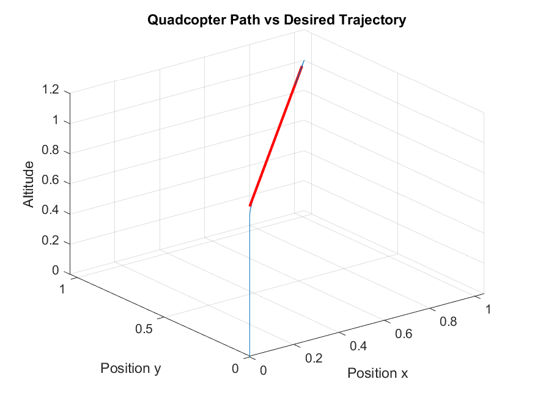
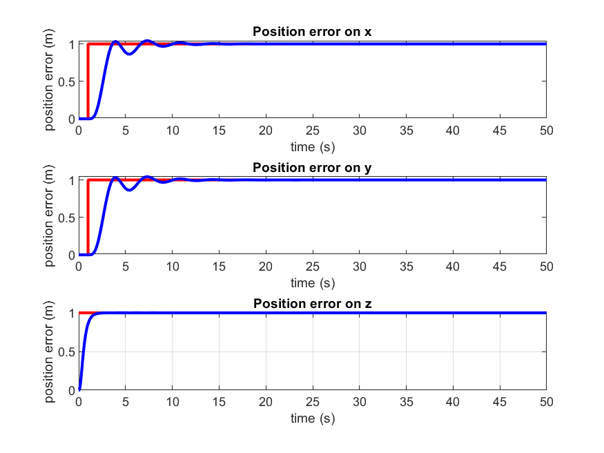
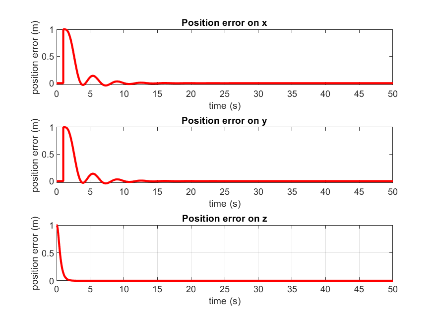
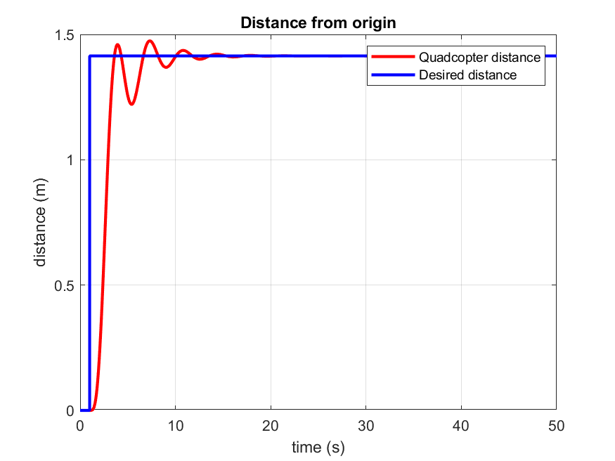
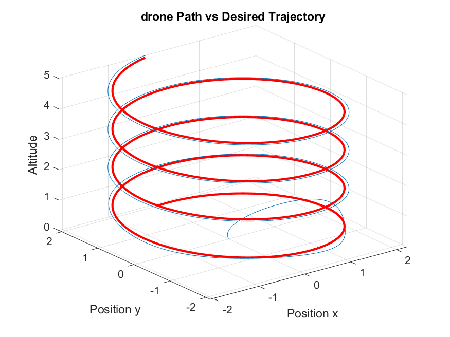
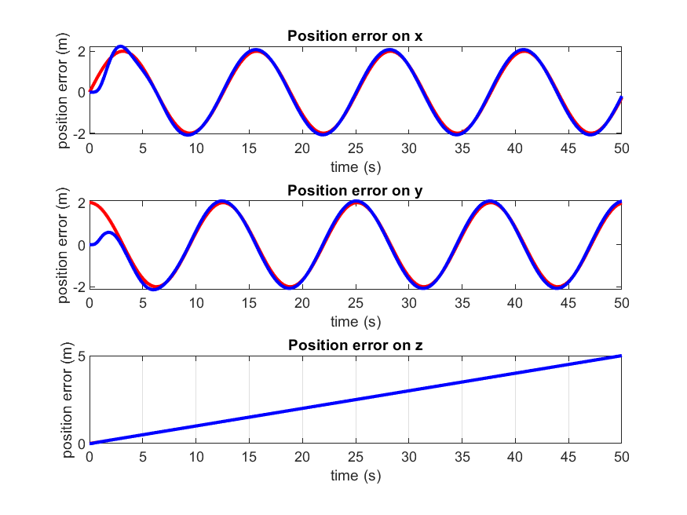
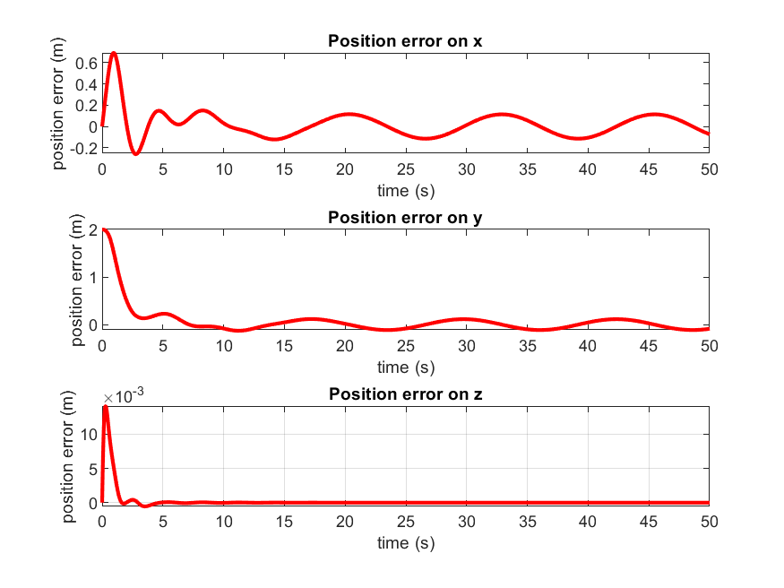
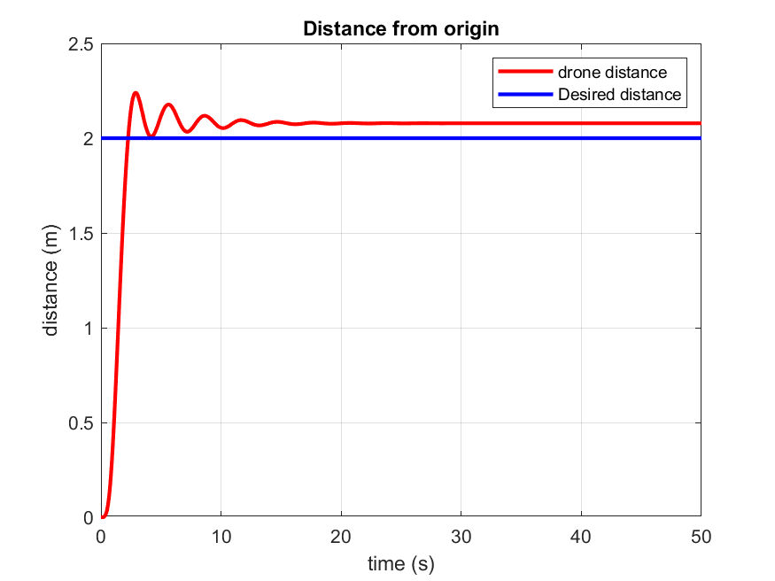

# CrazyFly Drone Simulation & Control Suite

A turnkey MATLAB framework for Crazyfly‑style quadrotor dynamics and control, featuring:

- Full 6‑DOF vehicle equations with inertia coupling
- First‑order motor response
- Cascaded PID loops (altitude, position, attitude)
- Feedback linearization for loop decoupling
- Multiple reference patterns: hover, steps, circle, spiral
- Automated plots and MP4 flight visualization

## 📂 Contents

1. [Highlights](#highlights)
2. [Quick Start](#quick-start)
3. [Concepts for Beginners](#concepts-for-beginners)
4. [Architecture & Diagrams](#architecture--diagrams)
5. [Dynamics & Models](#dynamics--models)
6. [Control & Feedback Linearization](#control--feedback-linearization)
7. [Scripts & Workflow](#scripts--workflow)
8. [Parameters & Gains](#parameters--gains)
9. [Results & Visualization](#results--visualization)
10. [Future Extensions](#future-extensions)
11. [References](#references)

---

## ✨ Highlights

- **6‑DOF Translational & Rotational Equations**
- **Motor First‑Order Dynamics**
- **Cascaded PID with Linearizing Inversion**
- **Flexible Trajectories**: includes spiral helix demo
- **Visualization**: PNGs + `trajectory_following.mp4`

---

## ⚡ Quick Start

1. **Install prerequisites**: MATLAB R2018a+ with Aerospace Toolbox.
2. **Clone the repository**:
   ```bash
   git clone https://github.com/nrlhozkan/Drone-Simulation-and-Control.git
   cd Drone Simulation adn Control
   ```
3. **Add PID gains**: Copy `tunedGains.mat` into the project root.
4. **Run simulation**:
   ```matlab
   addpath(genpath(pwd));  % add all folders to MATLAB path
   main;         % launch simulation
   ```
5. **Configure flight**: In `main.m` header, adjust:
   ```matlab
   drone_configuration = 'cross';  % 'cross' or 'plus'
   trajectory          = 'spiral'; % 'hoverZ','hoverX','hoverY','hoverXY','spiral'
   ```

---

## 🧰 Concepts for Beginners

- **Quadrotor:** Drone with 4 rotors arranged in X/cross.
- **State (6‑DOF):** Position (x,y,z) + Orientation (φ,θ,ψ).
- **Cascaded Control:** Altitude → Position → Attitude loops.

---

## 🏗️ Architecture & Diagrams

**Control & Simulation Flow**:

1. **Reference Generation** (`ref_trajectory.m`): Desired position & velocity.
2. **Position Controller** (`drone_controller.m`): PID calculates force and desired tilts.
3. **Feedback Linearization**: Inverts nonlinear terms for altitude & planar loops.
4. **Attitude Controller** (`drone_controller.m`): PD on roll/pitch/yaw produces torques.
5. **Motor Mixing & Dynamics** (`drone_controller.m`): Computes individual rotor speeds and first‑order motor response.
6. **State Integration** (`ode45` in `main.m`): Updates vehicle states over time.

---

## 📐 Dynamics & Models

Modeling sits in `drone_controller.m`:

**Translational:**

$$
  \ddot p = \frac{1}{m}\,C_{b2i}(φ,θ,ψ)\,u_1 - g\,e_z
$$

**Rotational:**

$$
  J\dot ω + ω×(J\,ω) = τ + J_r\,\dot ω_r
$$

**Motor Dynamics:**

$$
  \dot ω_r = \frac{1}{t_o}(ω_d - ω_r)
$$

*See code lines 105–136.*

---

## 🎯 Control & Feedback Linearization

**Why Linearize?**

- Cancel known nonlinear terms → independent linear loops.
- Simplify design: use classic PID on each channel.
- Improve response time and null steady‑state error.

**Altitude Inversion:**

- Original: $\(\ddot z = -g + (u_1/m)\cosφ\cosθ\)$.
- Feedback linearization: solve for \(u_1=F\) so
  
  $$
    F = m\frac{g + u_z^d}{\cosφ\cosθ},
    \quad
    \ddot z = u_z^d.
  $$

**Planar Inversion:**

- Original lateral: coupling via φ,θ,ψ.
- Map desired accel $\([u_x^d,u_y^d]\)$ to target tilts:

  $$
    φ^d = \frac{u_x^d\sinψ - u_y^d\cosψ}{g},
    \quad
    θ^d = \frac{u_x^d\cosψ + u_y^d\sinψ}{g}.
  $$

**Attitude Loop:** PD control on φ,θ,ψ errors.

**Code Locations:**

- Altitude inversion:  `drone_controller.m`
- Planar mapping:    

---

## 📂 Scripts & Workflow

1. **main.m**: Initializes parameters, loads gains, computes hover speed, and calls `ode45`.
2. **drone\_controller.m**: Defines the 6‑DOF dynamics, feedback linearization, PID control, and motor mixing.
3. **ref\_trajectory.m**: Generates desired position (`pd`) and velocity (`vd`) references for selected patterns.
4. **Output**: Automatically saves PNG figures in `workspace` and writes the `trajectory_following.mp4` animation.

---

## 🔧 Parameters & Gains

| Parameter       | Symbol         | Value                      | Unit   |
| --------------- | -------------- | -------------------------- | ------ |
| Drone mass      | m              | 0.033                      | kg     |
| Arm length      | l              | 39.73e-3                   | m      |
| Gravity         | g              | 9.81                       | m/s²   |
| Thrust coeff.   | k\_f           | 2.8799e-8                  | N·s²   |
| Torque coeff.   | k\_m           | 7.2385e-10                 | N·m·s² |
| Inertia (X,Y,Z) | J\_x,J\_y,J\_z | 1.395e-5,1.436e-5,2.173e-5 | kg·m²  |
| Rotor inertia   | J\_r           | 3.2e-7                     | kg·m²  |
| Motor τ         | t\_o           | 20                         | s⁻¹    |

| Loop  | Gain                 | Value                   |
| ----- | -------------------- | ----------------------- |
| Alt.  | kp\_z, kd\_z         | 10, 6                   |
| Pos X | kp\_x, kd\_x, ki\_x  | 1.1063, 1.9290, 9.48e-9 |
| Pos Y | kp\_y, kd\_y, ki\_y  | 1.1022, 1.9233, 8.10e-9 |
| Att φ | kp\_phi, kd\_phi     | 10,6                    |
| Att θ | kp\_theta, kd\_theta | 10,6                    |
| Att ψ | kp\_psi, kd\_psi     | 10,6                    |

---

## 📊 Results & Visualization

### Step Response
  After running `main.m` with a **cross** configuration on the **hoverXY** step response, the following outputs demonstrate system performance:

  ** Figure 1: Actual vs. Desired Path**\
  • Overlay of actual (blue) and desired (red) steps. Near‑perfect alignment indicates precise feedback linearization and PID tuning.

  

  **Figure 2: Position Error Subplots**\
  • Error in X, Y, and Z. X/Y errors converge within ±0.01 m and Z error decays to <0.01 m, demonstrating fast settling and minimal steady‑state error.

  

  

  **Figure 3: Distance From Origin**\
  • Distances (drone vs trajectory). 
  

  **Animation**
  Step response animation shows drone controllers to step response. 

    <video controls
        src="https://github.com/user-attachments/assets/2bc7aa80-2fde-4106-85ea-beab1aa14d09"
        style="max-width:100%;">
    Your browser doesn’t support HTML5 video.
  </video>

### Helix Trajectory
  After running `main.m` with a **cross** configuration on the **spiral** trajectory, the following outputs demonstrate system performance:

  **Figure 1: Actual vs. Desired Path**\
  • Overlay of actual (blue) and desired (red) spirals. Near‑perfect alignment indicates precise feedback linearization and PID tuning.

  

  **Figure 2: Position Error Subplots**\
  • Error in X, Y, and Z. X/Y errors converge within ±0.2 m and Z error decays to <0.01 m, demonstrating fast settling and minimal steady‑state error.

  

  

  **Figure 3: Distance From Origin**\
  • Radial distance √(x²+y²) vs. target radius (2 m). The drone maintains within ±0.1 m of the desired radius throughout the flight.

  

  **Animation**

  - `trajectory_following.mp4` depicts live flight—showing real‑time drone and target indicators, with error vectors and orientation arms.

  <video controls
        src="https://github.com/user-attachments/assets/2bc7aa80-2fde-4106-85ea-beab1aa14d09"
        style="max-width:100%;">
    Your browser doesn’t support HTML5 video.
  </video>
---

---

## 🔮 Future Extensions

- Wind gusts & disturbance rejection
- EKF/UKF state estimation
- Energy‑optimal MPC flight planning
- Fault‑tolerant & multi‑UAV formation control

---

## 📚 References

1. M. A. Toksöz *et al.*, “Decentralized Formation Control of a Swarm of Quadrotor Helicopters,” IEEE ICCA 2019.

---

*Prepared by [Nurullah Özkan], [23.07.2025]*

